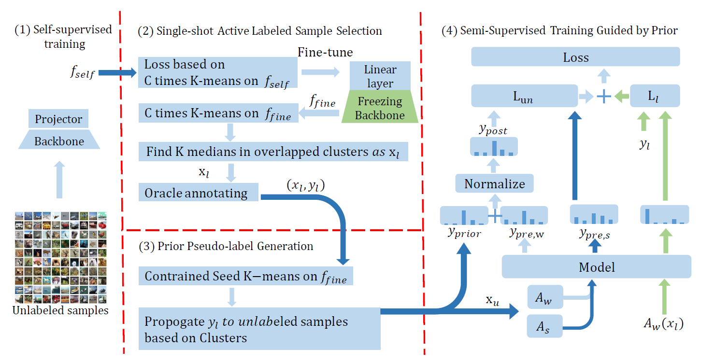

Key observations:

1.  Weight initialization struggles to effectively transfer valuable information obtained from self-supervised training to the semi-supervised model
2.  Label propagation on pre-trained features to construct prior pseudo-labels, serving as an effective intermediary to transfer information from self-supervised learning to semi-supervised models.
3.  Adapt active learning to improve the accuracy of prior pseudo-labels. 

