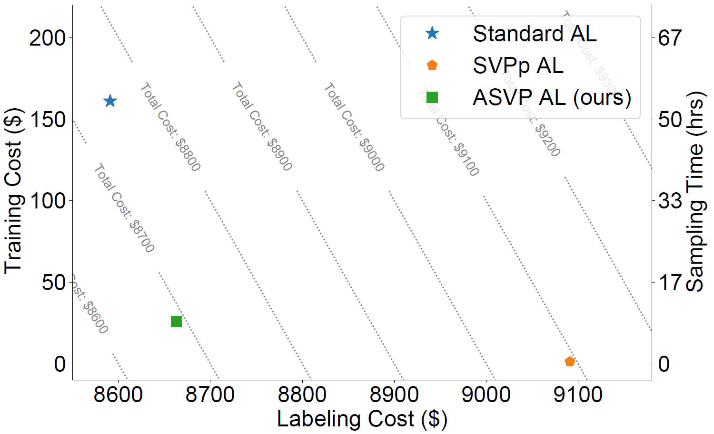

The contents above will be part of a list of publications, if the user clicks the link for the publication than the contents of section will be rendered as a full page, allowing you to provide more information about the paper for the reader. When publications are displayed as a single page, the contents of the above "citation" field will automatically be included below this section in a smaller font.

